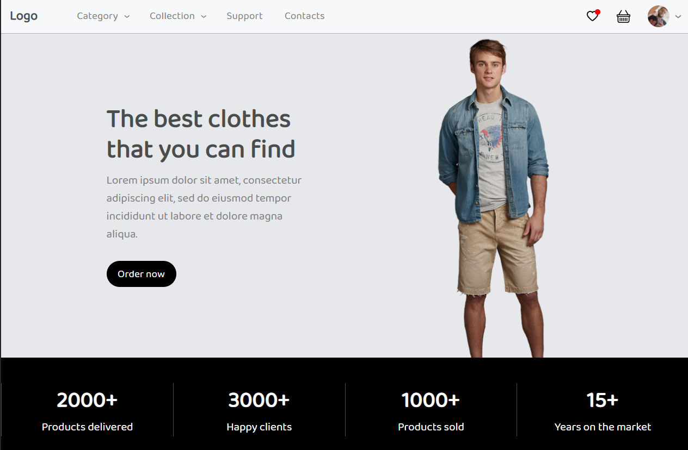
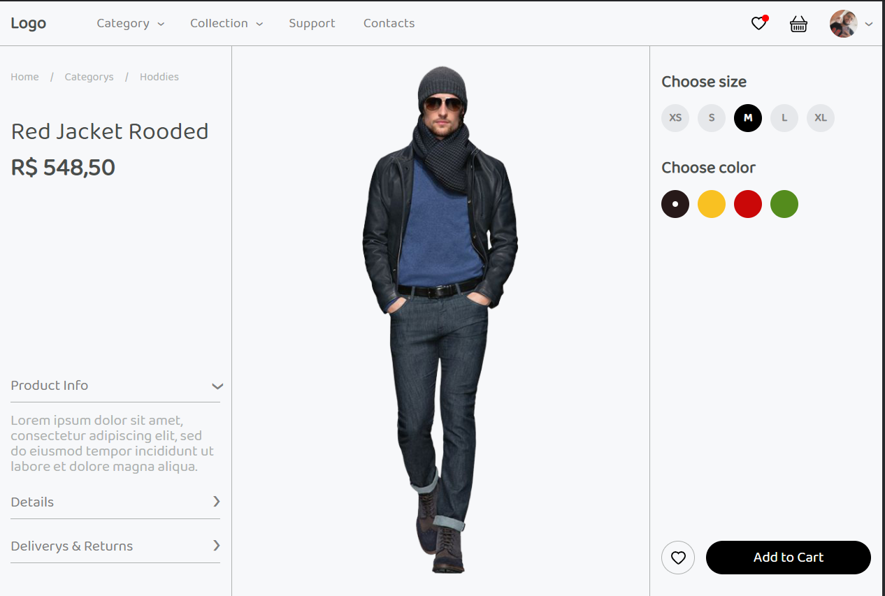
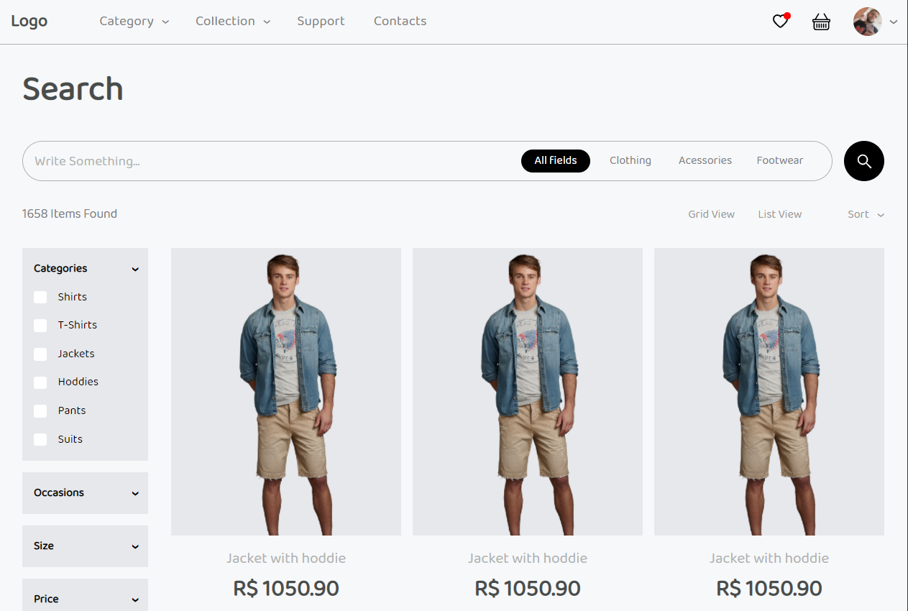
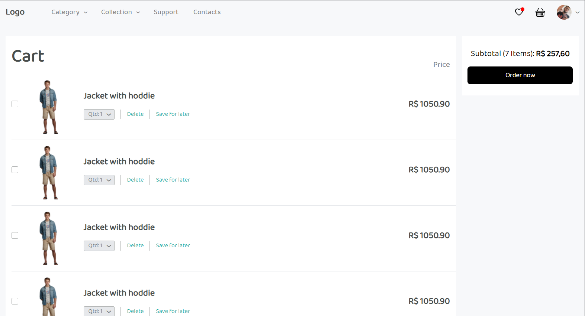

# **E-Commerce**

Site de um simples e-commerce para venda de roupas 

-- --

## **Screenshots**

-- --

## **Features**

- Tela Home
- Tela Product
- Tela Product List
- Tela Cart

-- --

## **Getting Started**

### Abra o Prompt de Comando

    git clone https://github.com/MatheusGomesRocha/e-commerce

    cd recipe_RN && npm install`

### Abra um novo Prompt de Comando

    cd path/e-commerce && npm start 
    
-- --

## **Tecnologia usada**

- React-native

-- --
## Meta

- Matheus Gomes
- Email - matheusgomes192@hotmail.com
- Linkedin - https://www.linkedin.com/in/matheus-gomes-2a61a8190/ 
